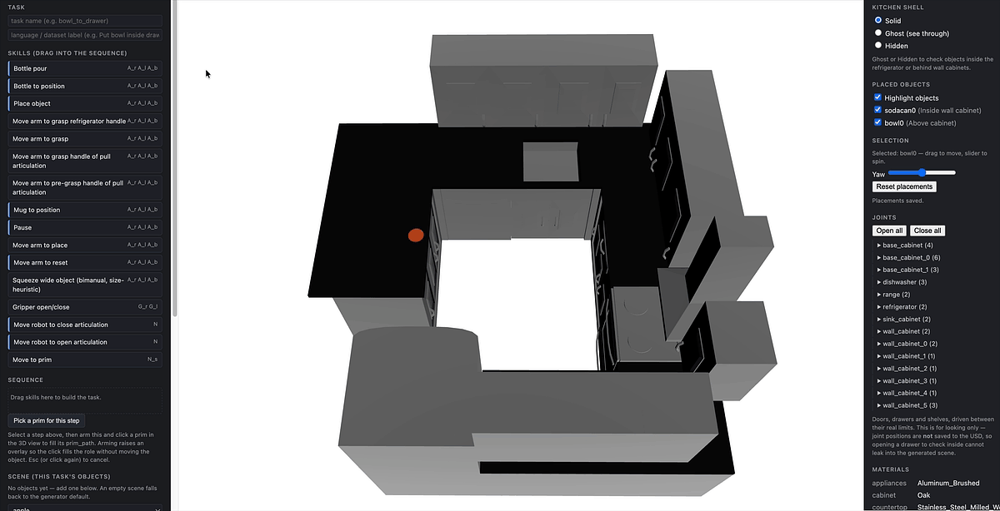
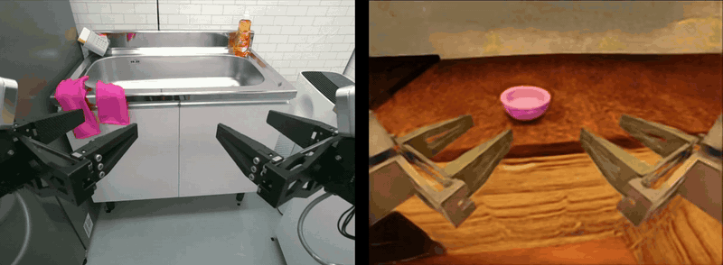
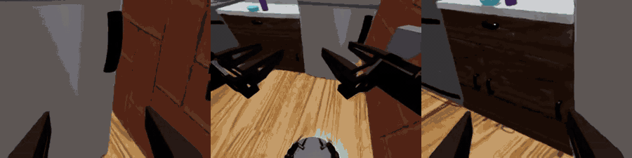
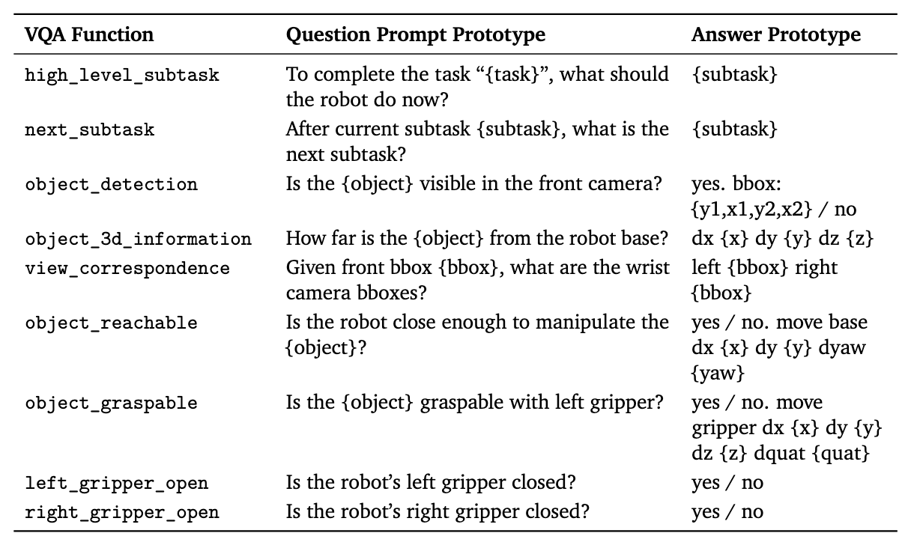

# SimVLA: Zero-shot Sim-to-Real VLA Learning for Mobile Manipulation

[](https://github.com/kyounginbaik/SimVLA/actions/workflows/package.yml)
[](pyproject.toml)
[](LICENSE)

[Project page](https://kyounginbaik.github.io/simvla/) · [Paper](https://kyounginbaik.github.io/simvla/static/pdfs/SimVLA.pdf) · [Video](https://kyounginbaik.github.io/simvla/static/videos/simvla_teaser.mp4) · [Datasets](https://huggingface.co/collections/kyounginbaik/simvla-data)

## SimVLA overview

Generate procedural kitchens, compose mobile-manipulation tasks from reusable skills, and
build robot-action and grounded visual-question-answering datasets. This is the research
code behind SimVLA's zero-shot sim-to-real mobile-manipulation work.

[](https://kyounginbaik.github.io/simvla/static/videos/simvla_teaser.mp4)


## Installation

Full step-by-step instructions live in **[docs/installation.md](docs/installation.md)**. The
hash-locked kitchen, Anubis, RB-Y1, and AI Worker assets are available as a separate
[SimVLA-assets download](https://huggingface.co/datasets/kyounginbaik/SimVLA-assets). For an
existing research checkout, the [verified staging recipe](docs/installation.md#reproduce-the-three-robot-kitchen-setup-from-a-research-checkout)
validates and links the source trees without duplicating the large asset corpus.


```bash
python -m venv .venv
source .venv/bin/activate
python -m pip install -e '.[scenes]'
simvla demo --output-dir outputs/quickstart
```


## Documentation

### 1. Kitchen Scene Generation

Generate one of five procedural layouts on a CPU:

```bash
simvla scene --layout l_shaped --seed 1 --output outputs/kitchen.glb
```

For USD generation with Isaac Sim, see [Kitchen Scene Generation](docs/simulation.md#1-kitchen-scene-generation).

### 2. Goal Generation

Build task JSON from registered skill APIs, validate it, and bind it to a kitchen:

```bash
simvla skills
simvla init-task --from bowl_to_drawer --name my_task --output outputs/my_task.json
simvla validate outputs/my_task.json
```



See [task authoring](docs/task-authoring.md) and [Goal Generation](docs/simulation.md#2-goal-generation), including instructions for adding skills and using AI Worker.

### 3. Hybrid System Identification

Fit robot stiffness and damping against a real recording.



See [Hybrid System Identification](docs/simulation.md#3-hybrid-system-identification).

### 4. SimAction Generation

Collect synchronized robot actions and multi-view observations in IsaacLab.



See [SimAction Generation](docs/simulation.md#4-simaction-generation).

### 5. SimVQA Generation

Convert captured RGB and segmentation observations into grounded questions and answers:

```bash
simvla vqa examples/vqa --output outputs/questions.jsonl
```



See [SimVQA Generation](docs/simulation.md#5-simvqa-generation).

### 6. SimVLA Training

The paper uses SimAction and SimVQA pre-training followed by SimAction and SimDeploy post-training. The training recipe and checkpoint are not included in this repository. See the [reproducibility map](docs/reproducibility.md).

### 7. SimDeploy Generation

SimDeploy generates deployment-oriented simulator data for post-training. Its public training adapter and checkpoint are not included. See [Training and SimDeploy](docs/simulation.md#67-training-and-simdeploy).

### 8. Evaluate in IsaacLab

Run a physics and camera smoke test before evaluation:

```bash
KITCHEN_NUMBER=99001  # choose a kitchen excluded from training
SUB_NUMBER=00         # one of its generated variants
simvla run smoke --repo-root . -- \
  --task "Isaac-Kitchen-v${KITCHEN_NUMBER}-${SUB_NUMBER}" --seed 0 --headless
```

Task IDs follow `Isaac-Kitchen-v<kitchen_number>-<sub_number>`. For zero-shot evaluation, choose a kitchen number excluded from training. See [Evaluate in IsaacLab](docs/simulation.md#8-evaluate-in-isaaclab).

## Citation

If you use SimVLA in your research, please cite:

```bibtex
@misc{baik2026simvla,
  title={SimVLA: Zero-Shot Sim-to-Real VLA Learning for Mobile Manipulation},
  author={Kyoungin Baik and Youngwoon Lee},
  year={2026},
  eprint={2610.11248},
  archivePrefix={arXiv},
  primaryClass={cs.RO},
  url={https://arxiv.org/abs/2610.11248},
}
```

## License

See [LICENSE](LICENSE).

## Contributing

See [CONTRIBUTING.md](CONTRIBUTING.md).
