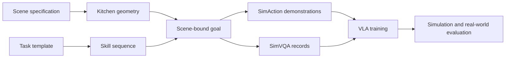

# Reproducibility map

This page maps SimVLA's public artifacts to claims that can be checked from this release. It is intended for researchers deciding whether to reuse the task representation, add a skill or embodiment, or reproduce a simulator workflow. The evidence here is deliberately narrower than the paper: an integration check is not a policy benchmark, and CPU validation does not establish physical feasibility.



The public CPU package covers scene specifications through task and goal validation. The source
checkout contains simulator generation, demonstration, VQA, replay, and evaluation workflows.
Training and the paper checkpoint are not included in this repository, so the final two boxes are a
research interface rather than a reproducible public pipeline today.

**Sink-task limitation:** earlier kitchen-813 sink references use a proximity
predicate and do not prove containment. The stage-local cavity repair and
below-rim predicate now have a bounded RB-Y1 batch and AI Worker physics-12
collection/replay reference. This validates those named recipes only; do not
reinterpret earlier proximity passes or infer arbitrary-task reliability. See
[the sink follow-up](validation.md#sink-cavity-follow-up) and the dated robot
evidence records.

## Pick the smallest useful track

### Anubis kitchen-813 reference

The current fresh public-runtime chain is collection **2426755** → replay
**2429275**: 1,212 frames, 26 SimVQA records, 156 images and 275 Q/A examples.
Replay restores recorded initial object velocities as well as poses.
[Fresh public-runtime evidence](evidence/clean-public-anubis-2026-10-06.json).
The runs below are additional historical references.

Fresh collection **2411130** passed export validation (1,352 frames, three cameras,
initial and terminal scene snapshots). Replay **2412901** passed physical success
on its first pass and SimVQA validation (26 records, 156 images, 275 Q/A examples).
The profile uses recorded joint motor targets plus bounded base-pose feedback,
not Cartesian/binary actions alone. A second collection succeeded but its replay
failed; these are reference demonstrations, not a measured reliability guarantee.
This is **one scene and seed**, not an all-robot, arbitrary-scene, or bitwise
determinism claim. [Evidence and limitations](evidence/anubis-fresh-reference-2026-10-06.json).

After installing the documented simulator/offline-export environments and external
assets, prepare the exact reference goal and load its checked-in settings:

Use an environment without leftover `SIMVLA_*` tuning overrides from another
experiment. These shell profiles override their listed settings; they do not
clear unrelated exported variables. Keep runtime/asset paths separate from
robot-specific control settings and inspect `source-evidence.json` afterward.

```bash
# SIMVLA_COLLECTION_ROOT must already name your shared output directory.
reference_goals=$(mktemp -d "${SIMVLA_COLLECTION_ROOT:?set shared output root}/anubis-reference-XXXXXX")
python scripts/tools/make_anubis_drawer_diagnostic.py \
  --output "$reference_goals/Isaac-Kitchen-v813-00.json" \
  --lateral-shift-m .17 --backoff-m .05 --swap-drawer-jaws --with-metadata
set -a
. configs/collection/anubis-kitchen813.env
set +a
export SIMVLA_SOURCE_GOAL="$reference_goals/Isaac-Kitchen-v813-00.json"
# Set SIMVLA_REPO_ROOT, SIMVLA_PYTHON, SIMVLA_EXPORT_PYTHON,
# SIMVLA_ASSETS_DIR, SIMVLA_ROBOT_MODELS_DIR, BODEX_OBJ_DIR,
# and SIMVLA_COLLECTION_ROOT as described in installation.md and env/README.md.
sbatch --export=ALL scripts/slurm/collect_public_lerobot.sbatch

# After collection-result.json reports passed=true, replace COLLECTION_JOB:
collected="$SIMVLA_COLLECTION_ROOT/simvla-public-lerobot-anubis-COLLECTION_JOB"
export TASK=Isaac-Kitchen-v813-00
export SIMVLA_DATASET="$collected/lerobot/$TASK/all"
export SIMVLA_GOALS_DIR="$collected/goals"
export SIMVLA_SIMVQA=1
sbatch --export=ALL scripts/slurm/replay_public_lerobot.sbatch
```

Read `collection-result.json`; a successful lift or a process exiting normally
does not establish an accepted, valid dataset. Then replay its `all/` dataset
using `scripts/slurm/replay_public_lerobot.sbatch`, the saved goal directory, and
the same six physics substeps. Successful replay writes `replay-status.json`,
three videos, and HDF5 physical terminal state. SimVQA semantic validation is a
separate gate; older captures that mislabeled drawer actions are not reference data.
Earlier replay **2402691** of collection 2400046 passed both physical replay and the
new SimVQA capture gate (26 records, 156 images, 276 generated Q/A examples).
See the [SimVQA evidence](evidence/anubis-simvqa-2026-10-06.json) for scope and hashes.
The metadata-enriched recipe was subsequently recollected on a second node:
collection **2402141** exported 1,212 frames, and replay **2403786** passed
physical success on its first pass plus the SimVQA capture gate (275 Q/A examples).

### RB-Y1 kitchen-813 reference

The current fresh public-runtime chain with approved camera-07 mounts is
collection **2424756** → replay **2426057**: 1,155 frames, 16 SimVQA records,
96 images and 164 Q/A examples. Replay is action-only, without recorded joint
targets or base-pose feedback.
[Fresh public-runtime evidence](evidence/clean-public-rby1-2026-10-06.json).
The runs below are additional historical references.

Fresh collection **2405318** completed mug-to-sink and exported 1,127 frames,
three synchronized 20 FPS videos, and initial/terminal scene snapshots. Independent
replay **2406630** reproduced physical success on its first pass and passed SimVQA
validation (16 records, 96 images, 158 Q/A examples). The older corrected export
also passed replay 2405317; keep these two evidence chains separate.
[Fresh collection and replay evidence](evidence/rby1-fresh-collection-2026-10-06.json).

Use the same installed runtime and external assets as above:

```bash
reference_goals=$(mktemp -d "${SIMVLA_COLLECTION_ROOT:?set shared output root}/rby1-reference-XXXXXX")
python scripts/tools/make_rby1_sink_diagnostic.py \
  --source examples/goals/Isaac-Kitchen-v813r-00.json \
  --parking-advance-m .10 --forward-m .30 \
  --output "$reference_goals/Isaac-Kitchen-v813r-00.json"
set -a
. configs/collection/rby1-kitchen813.env
set +a
export SIMVLA_SOURCE_GOAL="$reference_goals/Isaac-Kitchen-v813r-00.json"
sbatch --export=ALL scripts/slurm/collect_public_lerobot.sbatch

# After collection-result.json reports passed=true, replace COLLECTION_JOB:
collected="$SIMVLA_COLLECTION_ROOT/simvla-public-lerobot-rby1-COLLECTION_JOB"
export TASK=Isaac-Kitchen-v813r-00
export SIMVLA_DATASET="$collected/lerobot/$TASK/all"
export SIMVLA_GOALS_DIR="$collected/goals"
export SIMVLA_SIMVQA=1
sbatch --export=ALL scripts/slurm/replay_public_lerobot.sbatch
```

Retain the profile settings for replay, particularly physics substeps, gripper
stiffness, and contact-force control. Check **both** `replay-status.json` and
`simvqa-result.json`; a valid export alone is insufficient.
On a local GPU, replace `sbatch --export=ALL` with `bash` for either launcher.
Both create unique `local-...` run directories without requiring Slurm.

### AI Worker kitchen-813 reference

**Loaded-home and repaired-basin reference (2026-10-07):** collection 2437904
exported one 3,592-row episode and three synchronized 20 FPS videos. Independent
fresh-process replay 2437908 passed on its first pass, returning both arms to the
documented home tolerance after releasing the mug inside the repaired basin
acceptance region. SimVQA passed with 20 records, 120 images, and 205 Q/A examples.
The selected profile is `configs/collection/aiworker-kitchen813-loaded-physics12.env`:
12 physics substeps with force-balance increments reduced to 0.0025 per substep,
preserving the original 0.6/s control rate. Replay uses recorded non-gripper joint
motors, adaptive contact gripper control, bounded base feedback, initial joint
restoration, and the recorded one-tick prelude. It used zero extra terminal hold
steps, although the profile allows up to 100. This is one bounded kitchen-813,
seed-0 reproduction, not a multi-seed reliability benchmark or Cartesian-only
action replay. See the [dated evidence record](evidence/aiworker-loaded-home-physics12-2026-10-07.json).

The earlier extended-carry collection **2436772** exported 1,896 frames and six motor
samples per 20-Hz frame. Replay **2437094** passed the corrected 5-cm home gate
on its first pass at frame 1,914, followed by SimVQA validation (16 records,
96 images, 164 Q/A examples). It used physics-rate non-gripper motor targets,
live contact-controlled fingers, recorded initial joint state, bounded base
feedback, and **18 extra terminal hold steps (0.9 seconds)**. Without that extra
settling, replay 2436970 failed. This is not action-only or original-timing replay.
The profile below records these distinctions explicitly. See
[current evidence](evidence/aiworker-current-chain-2026-10-06.json). Its extended-carry
profile remains useful for the original timing comparison; the physics-12 recipe
above is the loaded-home and repaired-basin reference.

Earlier collection **2408283** completed and exported 1,915 frames, three synchronized
20 FPS cameras, and both scene snapshots. Physical replay **2412231** passed on
its first pass, followed by SimVQA validation: 16 records, 96 images, 161 Q/A
examples. This replay uses recorded joint motor targets plus bounded feedback
against recorded base poses; Cartesian/binary action-only replay failed.
[Evidence and limitations](evidence/aiworker-reference-replay-2026-10-06.json).
The recipe preserves native BoDex orientation, pauses halfway
through the cuRobo grasp trajectory, carries the mug without folding into an
unreachable pose, and parks at an angle for left-arm placement.

```bash
reference_goals=$(mktemp -d "${SIMVLA_COLLECTION_ROOT:?set shared output root}/aiworker-reference-XXXXXX")
python scripts/tools/make_aiworker_native97_diagnostic.py \
  --bank "${BODEX_OBJ_DIR:?set downloaded BoDex root}/graspdata_final/sim_parallel/core_mug_7d6baadd51d0703455da767dfc5b748e/floating/scale010_grasp_left.npy" \
  --preserve-grasp-carry --wall-clearance --carry-forward-m .15 --angled-sink \
  --output "$reference_goals/Isaac-Kitchen-v813a-00.json"
set -a
. configs/collection/aiworker-kitchen813-substeps.env
set +a
export SIMVLA_SOURCE_GOAL="$reference_goals/Isaac-Kitchen-v813a-00.json"
sbatch --export=ALL scripts/slurm/collect_public_lerobot.sbatch

# Only after collection-result.json reports passed=true:
collected="$SIMVLA_COLLECTION_ROOT/simvla-public-lerobot-aiworker-COLLECTION_JOB"
export TASK=Isaac-Kitchen-v813a-00
export SIMVLA_DATASET="$collected/lerobot/$TASK/all"
export SIMVLA_GOALS_DIR="$collected/goals"
export SIMVLA_SIMVQA=1
sbatch --export=ALL scripts/slurm/replay_public_lerobot.sbatch
```

The goal generator verifies the pinned bank hash before loading its NumPy object
array. The generated goal is not itself a demonstration; acceptance requires
successful physical execution, export validation, and independent replay.

For the requested **home-return carry**, replace
`--preserve-grasp-carry --wall-clearance --carry-forward-m .15 --angled-sink`
with `--return-home --wall-clearance --angled-sink`. This keeps the native BoDex
grasp and midpoint pause, then uses `arm.reset` to return the loaded left arm to
its original home before navigation. The gripper stays closed until sink release.
This is a different trajectory from the validated reference above; its retention,
placement, and replay must be checked separately. Do not cite the older carry-pose
episode as validation of the home-return variant.
Trial 2415397 reached home but dropped the mug during the reset; it is a failed
retention diagnostic, not a validated replacement for the reference trajectory.

Current home-return experiments use `SIMVLA_LOADED_HOME_JOINT_TARGETS=1` to hold
the seven left-arm motor targets through reset pauses and subsequent navigation.
`SIMVLA_AIWORKER_PAYLOAD_COLLISION=1` adds an eight-sphere conservative mug proxy
to the left-arm planner, requiring `SIMVLA_CUROBO_WORLD=live` and
`SIMVLA_CUROBO_TARGET_COLLISION=approach`. The proxy follows the measured grasp
transform for planning only: the physical mug remains free and can slip or fall.
Neither option is enabled by the reference profile or a demonstrated reliability
fix. Preserve both settings in experiment evidence and validate the full episode.

### Repaired-basin experiments (kitchen 813/00 only)

These are separate from the legacy proximity references. RB-Y1 collection
2437107 exported 1,210 frames; action-only replay 2437144 and SimVQA passed,
without extra terminal settling. AI Worker collection 2436991 exported 3,526
frames after passing the physical loaded-home/basin gate, but its independent
replays failed. The later physics-12 chain 2437904 → 2437908 passed collection,
replay, and SimVQA for one episode. Consult [current results](validation.md#follow-up-checks-2026-10-06)
and the dated evidence before promoting other profiles. The acceptance region checks the mug root below the
rim and inside a conservative XY disk, not full mesh containment or arbitrary kitchens.

Choose **one** robot below in a clean Bash environment, after setting the runtime,
external asset paths and shared output root described above. The profiles enable
the stage-local collision repair and stricter predicate together; downloaded USDs
are not edited.

RB-Y1:

```bash
basin_goals=$(mktemp -d "${SIMVLA_COLLECTION_ROOT:?set shared output root}/rby1-basin-XXXXXX")
python scripts/tools/make_rby1_sink_diagnostic.py \
  --source examples/goals/Isaac-Kitchen-v813r-00.json \
  --parking-advance-m .10 --forward-m .30 --output "$basin_goals/parking.json"
python scripts/tools/make_sink_cavity_diagnostic.py \
  --source "$basin_goals/parking.json" --eef-position 1.83 -2.20 1.08 \
  --output "$basin_goals/Isaac-Kitchen-v813r-00.json"
set -a
. configs/collection/rby1-kitchen813-basin.env
set +a
export TASK=Isaac-Kitchen-v813r-00
export SIMVLA_SOURCE_GOAL="$basin_goals/$TASK.json"
```

AI Worker (native BoDex grasp, actual loaded home, aisle detour, clearance raise):

```bash
basin_goals=$(mktemp -d "${SIMVLA_COLLECTION_ROOT:?set shared output root}/aiworker-basin-XXXXXX")
python scripts/tools/make_aiworker_native97_diagnostic.py \
  --bank "${BODEX_OBJ_DIR:?set downloaded BoDex root}/graspdata_final/sim_parallel/core_mug_7d6baadd51d0703455da767dfc5b748e/floating/scale010_grasp_left.npy" \
  --return-home --wall-clearance --angled-sink --aisle-waypoint \
  --raised-home-clearance --absolute-sink-placement --output "$basin_goals/home.json"
python scripts/tools/make_sink_cavity_diagnostic.py \
  --source "$basin_goals/home.json" --eef-position 1.80 -2.262 1.10 \
  --output "$basin_goals/Isaac-Kitchen-v813a-00.json"
set -a
. configs/collection/aiworker-kitchen813-loaded-basin.env
set +a
export TASK=Isaac-Kitchen-v813a-00
export SIMVLA_SOURCE_GOAL="$basin_goals/$TASK.json"
```

Then use the selected profile for both processes:

```bash
sbatch --export=ALL scripts/slurm/collect_public_lerobot.sbatch
# Wait for collection-result.json passed=true; replace COLLECTION_JOB below.
collected="$SIMVLA_COLLECTION_ROOT/simvla-public-lerobot-$ROBOT-COLLECTION_JOB"
export SIMVLA_DATASET="$collected/lerobot/$TASK/all"
export SIMVLA_GOALS_DIR="$collected/goals"
export SIMVLA_SIMVQA=1
sbatch --export=ALL scripts/slurm/replay_public_lerobot.sbatch
```

Re-running these goal-generation commands matched the tested source goals byte for
byte: RB-Y1 SHA-256 `677ebf1a19c2f39dc80508e7812ba1a7261600198e26eb47cafa314266f3e992`,
AI Worker `d7151f6b660c856d8a2accb4bc5f4bb069b65908d53662ad9fe092c5910d7d6c`.
This checks goal construction, not deterministic physics or replay success.

Recorder follow-up: manual retries can occur midway through a control iteration.
Initial snapshots now use the actual physics episode boundary immediately before
`env.step`, rather than the next script-counter tick. Earlier retry recordings
may contain an initial snapshot captured after their first action; those files
are not rewritten or described as exact pre-action state. Fresh collection is
being checked separately. Initial-joint restoration is therefore an explicit
experimental replay option, not a general determinism guarantee.

New collection also preserves the first, intentionally unexported control tick in
`scene_states.json` as `initial_step`: raw control, named motor targets, and optional
physics-rate motor targets. The exported observation/action/video streams still
start together after that tick, avoiding stale reset-camera frames. Explicit
`SIMVLA_REPLAY_INITIAL_STEP=1` executes this recorded tick after restoring the
initial joint state and before exported frame zero. It requires
`SIMVLA_REPLAY_INITIAL_JOINT_STATE=1` and verified new metadata; legacy datasets
without the prelude are rejected in this mode. The physical prelude is one
additional control tick outside dataset/video/SimVQA frame counts, not an extra
terminal settling tick. Defaults leave historical replay behavior unchanged.

For a fresh Anubis recording, use
`configs/collection/anubis-kitchen813-prelude.env` with the same
`make_anubis_drawer_diagnostic.py --lateral-shift-m .17 --backoff-m .05
--swap-drawer-jaws --with-metadata` goal preparation. This combination passed
collection 2437663 and independent replay/SimVQA 2437741: 1,418 exported frames,
one recorded prelude tick and zero extra terminal ticks. It remains a single-scene,
single-seed reference, not a general reliability claim.

For the three-episode RB-Y1 basin reference (2437751 → 2437810/11/12):

```bash
basin_goals=$(mktemp -d "${SIMVLA_COLLECTION_ROOT:?set shared output root}/rby1-approach-XXXXXX")
python scripts/tools/make_rby1_sink_diagnostic.py \
  --source examples/goals/Isaac-Kitchen-v813r-00.json \
  --parking-advance-m .15 --forward-m .30 \
  --place-position 1.88 -2.20 1.08 --final-approach-m .05 \
  --output "$basin_goals/approach.json"
python scripts/tools/make_sink_cavity_diagnostic.py \
  --source "$basin_goals/approach.json" --eef-position 1.88 -2.20 1.08 \
  --output "$basin_goals/Isaac-Kitchen-v813r-00.json"
set -a
. configs/collection/rby1-kitchen813-basin-approach.env
set +a
export TASK=Isaac-Kitchen-v813r-00
export SIMVLA_SOURCE_GOAL="$basin_goals/$TASK.json"
```

Use the collection launcher above, then replay **each** accepted episode in a
separate process with `SIMVLA_REPLAY_EPISODE_INDEX=0`, `1`, and `2` respectively.
This profile uses nominal goal targets and a straight approach after finishing
the turn. It retains the basin collision repair and interior acceptance gate.
The reference exported 3,873 frames; all three replays passed without extra
terminal settling. Initial joint restoration and the recorded prelude are
required. See [the bounded evidence](evidence/rby1-basin-batch-2026-10-06.json).

`configs/collection/aiworker-kitchen813-loaded-prelude.env` is the base experimental
profile using the historical six-substep dynamics. Its six-substep loaded-home
runs did not reproduce reliably. Use the explicitly validated physics-12 profile
above for this task; match the force-balance increment between collection and replay.

The native-grasp diagnostic accepts `--candidate-index 0..99` for controlled
experiments with other candidates from the same hash-verified public BoDex bank.
The default remains 97, preserving previous goal files. Each candidate retains
its native orientation composed only with the robot's tool frame; the existing
wrist-camera-up check rejects incompatible orientations. A bank error score is
not evidence of physical retention on AI Worker, and alternate candidates are
not validated references until collection and independent replay pass.

For controlled finer-physics experiments, `SIMVLA_GRIPPER_BALANCE_STEP_FRACTION`
sets the force-balancing preload increment **per physics substep** (default
0.005, validated finite and in `(0, 1]`). At 20 control frames/s, six substeps
and 0.005 give a maximum preload-fraction change of 0.6/s. Twelve substeps
with 0.0025, or 24 with 0.00125, preserve that controller rate while refining
integration. The 12-substep/0.0025 combination passed one loaded-home collection
and independent replay (2437904 → 2437908). The 24-substep comparison was stopped
before its allocation ended and is not a pass or physical failure result. Always
use matching settings for collection and replay; other substep rates remain
experimental.

### Track status

| Track | Public input | Entry point | Expected evidence | Status |
| --- | --- | --- | --- | --- |
| CPU quickstart | Bundled task plus procedural scene generator | `simvla demo` | GLB, editable task JSON, and manifest | Reproducible on CPU with `.[scenes]` |
| Task authoring | Eight bundled templates and 24 skill declarations | `simvla init-task`, `skills`, `validate` | A valid editable task JSON | Reproducible on CPU |
| Goal inspection | Two legacy goals and checked-in kitchen-813 goals for all three robots | `simvla validate-goal` | Structural/action-channel report | Reproducible on CPU; physical execution not implied |
| Kitchen geometry | Five procedural layout types | `simvla scene` | A reloadable, nonempty GLB | Reproducible on CPU with `.[scenes]` |
| VQA conversion | One small captured example | `simvla vqa examples/vqa` | 12 Q/A records | Reproducible on CPU from a checkout |
| Offline LeRobot export | Successful staged arrays/images plus exact collection goal | `scripts/tools/offline_finalize_lerobot.py` in the [separate environment](../env/README.md#separate-offline-exporter-python-310-linux-x86_64) | Validated Parquet and frame-aligned videos | Fresh locked CPU environment passes synthetic exports for all three robot schemas; physical collection is a separate gate |
| New skill contract | Isolated `gripper.open` example | `pytest tests/test_skill_extension_example.py` | Declaration, planning, template, and goal checks | Reproducible on CPU |
| Pinned three-robot kitchen setup | Public [SimVLA-assets bundle](https://huggingface.co/datasets/kyounginbaik/SimVLA-assets) plus simulator runtime | Verify bundle SHA-256, extract externally, three `doctor` checks and task smokes | Locked asset manifest, generated AI Worker URDF, finite joints, and camera images | Assets are publicly downloadable; local RTX 3090 smokes passed |
| Simulator scene and goal generation | Source scripts plus pinned public runtime/assets | `simvla run goals`, robot adapters, `smoke` | Goal file, adapted config, and one-environment smoke | Public-path goal generation, adaptation, schema validation, and fresh smoke passed for Anubis, RB-Y1, and AI Worker on kitchen 813 rotation 0; full scene regeneration remains a separate workflow |
| Demonstration and VQA collection | Source scripts plus external runtime/assets | `simvla run collect`, `replay` | Complete accepted episodes, validated export and replay | Fresh bounded Anubis, three-episode RB-Y1, and AI Worker loaded-home/basin chains pass on their named kitchen-813 profiles. Replay control modes differ; follow the exact profiles and [dated evidence](validation.md#follow-up-checks-2026-10-06). No arbitrary-task reliability claim. |
| AI Worker authoring and smoke | Adapter, left-arm template, and public hash-locked asset bundle | `simvla run goals`, `adapt-aiworker`, `smoke` | Adapted task, finite joints, cameras, and held lift home | Public left-arm goal emits and passes a fresh smoke. The clean-overlay trace verified the left-arm joint-limit clamp lets reset planning proceed, but did not complete a task. |
| AI Worker public collector | Adapted goal, public assets and corrected planning model | `simvla run collect` | Native BoDex grasp, cuRobo approach with midpoint pause, retained lift and complete task | Collection 2408283 exported 1,915 validated frames; joint-target/base-feedback replay 2412231 and SimVQA validation passed. Earlier failed replays are retained, not counted as demonstrations. [Details](evidence/aiworker-reference-replay-2026-10-06.json). |
| AI Worker historical reproduction | Historical collector, compatibility overlay, and external assets | Recorded reproduction command and settings | Completed LeRobot episode with synchronized videos | Five earlier episodes total 8,137 frames. Job 2356722 reproduced one 1,593-frame episode; job 2357115 validated an earlier symmetric home with one 1,375-frame episode, before pose option 1 became the default. The current selected-home public reference is documented above; these older runs are historical evidence only. |
| RB-Y1 mug to sink | `mug_to_sink`, RB-Y1 adapter, public hash-locked asset bundle | `simvla adapt-rby1`, `smoke`, `collect` | Registered RB-Y1 task, accepted export and replay | Fresh collection 2405318, first-pass physical replay 2406630, and SimVQA capture validation passed. One kitchen/seed, not arbitrary-task reliability. [Earlier recovery evidence](evidence/rby1-corrected-replay-2026-10-06.json). |
| Learned-policy evaluation | Evaluation source | `simvla run evaluate` | Per-trial success and aggregate metrics | No public compatible checkpoint or benchmark result in this release |

See the [evaluation protocol](evaluation-protocol.md) for comparable policy reporting,
[release validation](validation.md) for observed versions and bounded run results, and [the
100-item release audit](release-audit.md) for unresolved requirements. The [release reference
comparison](reference-comparison.md) records the onboarding and reproducibility patterns checked
against pinned SimToolReal and FlashSAC revisions.

The [external asset bundle](https://huggingface.co/datasets/kyounginbaik/SimVLA-assets) contains
14 source-file hashes and the generated AI Worker URDF hash. The [local asset staging recipe](installation.md#reproduce-the-three-robot-kitchen-setup-from-a-research-checkout)
checks the same lock before linking research checkouts. On 2026-10-01, the staged
813 kitchen passed 10-step, one-environment GPU smokes for Anubis (job 2366699), RB-Y1
(2366717), and AI Worker (2366731). All reported finite state and non-constant cameras; the
AI Worker lift target error after the short check was 0.0138 m. These runs establish a repeatable
local simulator setup. A fresh Conda/pip installation also passed 197 portable tests and three
RTX 3090 smokes (jobs 2368351, 2368424, 2368425) with the staged assets. They do not establish
robot-specific goal generation, full episode success, a dependency-consistent lockfile, or public
distribution of the external assets.

## Reproduce the public CPU artifacts

Use Python 3.10–3.12 from the repository root:

```bash
python -m venv .venv
source .venv/bin/activate
python -m pip install -e '.[scenes]'

simvla demo --output-dir outputs/quickstart
simvla validate bowl_to_drawer
simvla validate-goal examples/goals/Isaac-Kitchen-v813-00.json
simvla scene --layout single_wall --seed 0 --output outputs/kitchen.glb
simvla vqa examples/vqa --output outputs/questions.jsonl
python -m pytest tests/test_skill_extension_example.py -q
```

The two validators report valid inputs, the GLB has nonempty finite geometry, the VQA command reports 12 examples, and the focused skill-extension test passes. Creation commands refuse to replace existing files; remove the previous output or choose a new path for a repeat run.

The checked-in `Isaac-Kitchen-v813{,r,a}-00.json` goals remove a private goal-file
dependency from collection trials. After completing the public-bundle simulator setup in
[installation](installation.md), a Slurm cluster can launch one trial per embodiment with
`scripts/slurm/collect_public_lerobot.sbatch`. Export `SIMVLA_REPO_ROOT`,
`SIMVLA_PYTHON`, `SIMVLA_ASSETS_DIR`,
`SIMVLA_ROBOT_MODELS_DIR`, `BODEX_OBJ_DIR`, and `SIMVLA_COLLECTION_ROOT` to
point at your installation; RB-Y1 also needs `SIMVLA_RBY1M_DIR`. Set
`SIMVLA_COMPAT_OVERLAY` only if using the documented compatibility overlay; a complete
simulator environment needs no overlay. Read and accept NVIDIA's EULA yourself before
setting `OMNI_KIT_ACCEPT_EULA=YES`. The launcher never accepts it on your behalf.
For example, from the checkout root:

```bash
# First inspect resolved paths without starting Isaac or creating output:
ROBOT=aiworker SIMVLA_DRY_RUN=1 bash scripts/slurm/collect_public_lerobot.sbatch
# Supply your cluster's GPU partition (and account/QoS if required):
sbatch --partition=YOUR_GPU_PARTITION --export=ALL,ROBOT=anubis scripts/slurm/collect_public_lerobot.sbatch
sbatch --partition=YOUR_GPU_PARTITION --export=ALL,ROBOT=rby1 scripts/slurm/collect_public_lerobot.sbatch
sbatch --partition=YOUR_GPU_PARTITION --export=ALL,ROBOT=aiworker scripts/slurm/collect_public_lerobot.sbatch
# Or, on a local GPU with the same environment settings:
ROBOT=aiworker bash scripts/slurm/collect_public_lerobot.sbatch
```

Set `SIMVLA_SEED` to a canonical integer in `[0, 4294967295]` (default `0`) to
select and record the collection seed. Use distinct seeds when measuring
reliability; retain failed runs in the denominator. A fixed seed is not a promise
of bit-identical GPU physics across hardware or simulator versions.
The launcher also bounds Kit/USD/BLAS CPU workers to `SLURM_CPUS_PER_TASK`
(eight locally), with an explicit `SIMVLA_CPU_THREADS` override. This avoids
creating a host-sized worker pool inside a small cluster allocation. The resolved
count is shown by dry run and recorded in provenance.
For grasp debugging, `SIMVLA_TRACE_LIFT=1` writes JSON records prefixed with
`[lift-trace]` every ten lift ticks: measured object mass/material, object/jaw
poses, named finger positions/targets, and separate distal/proximal pad loads. This option does not alter
control or acceptance thresholds. Front-camera captures remain the visual check.

Diagnostic overrides are not validated recipes by themselves.
`SIMVLA_REQUIRE_CUROBO_PLAN=1` rejects failed arm plans instead of using the
legacy Cartesian fallback. It does not assert whole-body/payload collision
coverage or perfect trajectory tracking. The AI Worker reference profile
enables this guard. On planning failure, inspect the logged start-state spheres:

```bash
python scripts/tools/inspect_planner_failure.py collector.log \
  --robot-config configs/curobo/robot/aiworker_left_arm.yml
```

Sphere overlap reports explain the configured model; they are not justification
for adding collision-ignore pairs or shrinking geometry without checking the robot.

`SIMVLA_PHYSICS_SUBSTEPS=6` uses six physics steps per action while preserving
the original control/render rate (120 Hz physics for a 20 FPS task). Collection
and replay both honor it; use the same setting for both. `SIMVLA_NAV_FINAL_YAW`
sets the final parking-angle tolerance separately from the bearing-to-waypoint
tolerance. `SIMVLA_PREGRASP_STANDOFF` sets the right-arm planner and final-approach
standoff together. These settings are recorded in provenance, not inferred from
a successful-looking video.

Every normally completed launcher run now writes `collection-result.json`,
including zero-episode and exporter failures. Its `passed` field means staged/
finalized episode counts and dataset integrity agree; it is **not** the full
reproducibility gate. A scheduler kill can prevent the report from being written;
a missing report never means success. `SIMVLA_EXPORT_PYTHON` selects the
[separate offline export environment](../env/README.md#separate-offline-exporter-python-310-linux-x86_64).

There are no maintainer-specific filesystem paths or cluster partition defaults in this
launcher. `SIMVLA_PYTHON` defaults to `python` on PATH, and `SIMVLA_COLLECTION_ROOT` to
`outputs/` in the checkout. `ffmpeg` on PATH (or `SIMVLA_FFMPEG`) encodes optional front-camera
review videos. Kitchen collision checking is enabled by default. Existing run directories
are refused, and a zero-episode run exits unsuccessfully rather than claiming collection.
Each run records its source revision, dirty-tree status, goal/collector hashes,
package versions and import locations, and allowlisted collection settings in
`source-evidence.json`. Import locations help detect a stale editable installation
or an accidental dependency on a different research checkout. This report does
not archive the entire dirty worktree; a public reproduction still needs a pinned,
clean source revision and the documented asset hashes. A collector crash preserves
review captures when available.

Successful new launcher runs additionally write `dataset-evidence.json` with a
SHA-256 for every finalized `all/` file, including actions, reset-state metadata,
physics-rate motor targets and videos. New replay source reports fingerprint the
same input tree. Compare `datasets[0].content_sha256` to establish that both runs
used identical dataset bytes; the digest is independent of the directory's
location. This costs one sequential read of the complete dataset per report.
Use closed, materialized datasets: symlinks and special files are rejected, and
the report must live outside the dataset. Older reports without this field do
not retroactively gain a collection-time fingerprint. Exact input bytes are not
a promise of bitwise GPU physics or task success.

Validate a finalized dataset without installing Isaac Sim:

```bash
python -m pip install '.[data]'
python scripts/tools/validate_lerobot_collection.py /path/to/lerobot/task/kitchen/all
```

This checks finite states/actions, consecutive frame indices, per-episode lengths, synchronized
timestamps, decoded video counts, image dimensions, and FPS. It does **not** prove physical task
success: that must come from the simulator's acceptance checks and review evidence.

To regenerate a compositional v2 goal from a checked-in template and the public kitchen,
submit `scripts/slurm/emit_public_goals.sbatch` with `SIMVLA_GOAL_OUTPUT_ROOT` set to a
new output directory. Set `SIMVLA_TASK_TEMPLATE` to the desired template and
`SIMVLA_ROBOT=rby1` or `aiworker` when authoring those embodiments. The launcher
then adapts the generated configuration and renames its goal to the `r` or `a`
task ID. Use a separate source workspace for simultaneous authoring jobs: they
write the common intermediate kitchen config before adaptation. Emitted goals
still need schema validation and a physical collection trial before replacing the examples.

Each job writes to a unique `<collection-root>/simvla-public-lerobot-<robot>-<job-id>`
directory. An initialized HDF5 file or a passing grasp precheck is **not** a successful
dataset: require an accepted episode, nonempty LeRobot tables, matching video counts,
and a passing replay before citing the collection as reproduced. The Slurm script exits
nonzero unless it finds a staged successful episode and the finalized `all` dataset passes
metadata, parquet row, finite action/state, and decoded-video frame checks. Replay validation
is a separate requirement.

For a bounded repeated-episode run, set `SIMVLA_NUM_DEMOS=10` (default: one).
The result checker requires at least that many validated episodes; a frame-budget
exit with a partial dataset is reported as incomplete, not successful. Increase
the frame/time budgets deliberately and retain failed-run reports. This launcher
uses one environment; multi-environment throughput is not validated by this option.

Grasp-search target augmentation is explicit: `SIMVLA_GOAL_NAV_XY_STD_M`
defaults to `0.03` metres, `SIMVLA_GOAL_NAV_YAW_STD_RAD` to `0.1` radians, and
`SIMVLA_GOAL_ARM_XYZ_STD_M` to `0.01` metres. These perturbations apply during
the partial-grasp search; a banked partial recipe can retain its perturbed
navigation and placement targets in later full-task attempts. A fixed absolute
placement can become unreachable from a perturbed parking pose. Set all three
to `0` for an explicitly nominal-target experiment, and report that choice;
it is not randomized robustness evidence. Initial scene/spawn, lighting and
camera randomization are separate and are not disabled by these settings.
The values are printed and included in runtime provenance when set. Existing
reference profiles retain their historical defaults unless explicitly stated.

For another authored scene, supply both `SIMVLA_TASK=Isaac-Kitchen-v435-03` and
`SIMVLA_SOURCE_GOAL=/path/to/that-scene-goal.json`. Preflight checks the robot
suffix, kitchen/rotation metadata and generated configuration before booting Isaac.
Emit/register the configuration first. These controls enable experiments; the
kitchen-813 reference physics and contact settings do not certify other tasks.

For new 23-value Cartesian actions, columns 9 and 19 are binary gripper commands:
`-1.6` means open and `+0.1` means close. They are not measured finger positions
or contact-controller motor targets. The corresponding observation channels
describe measured closure, normalized using each robot's signed joint stroke.
The export validator rejects nonbinary command values. Earlier RBY1 exports
using the wrong motor polarity must not be replayed as valid commands; the
original HDF5 raw actions can be used by `scripts/tools/recover_gripper_export.py`
to create a separate corrected stage, with provenance, for re-export. A recovered
export still needs physical replay and does not count as a new collection.
`scripts/slurm/replay_public_lerobot.sbatch` runs that separate check with a fresh
output directory. Set `SIMVLA_DATASET` to the finalized `all/` directory,
`SIMVLA_GOALS_DIR` to the collection's `goals/`, `ROBOT` and `TASK`, together with
the same asset/runtime paths and physics/contact settings used for collection.
New recordings also restore the robot's articulation-root pose and velocity from
`meta/scene_states.json`. The older `initial_pose` feature describes `base_link`,
which is not necessarily the articulation root: confusing them shifted AI Worker
by about 13.5 cm. AI Worker therefore requires the initial root snapshot; older
datasets without it must be recollected. This does not restore every joint,
contact cache, or random-number-generator state, and is not bitwise replay.
Recorded object reset linear/angular velocities are restored along with reset
poses where the task has an object-reset event. Omitting this momentum caused
fresh Anubis replay 2428146 to fail; corrected replay 2429275 passed. Older datasets
without reset snapshots cannot provide this guarantee. A failed automatic reset
now ends the replay pass immediately; remaining actions never continue against
the replacement scene. Failure videos retain front and both wrist views at the
configured control FPS.
An opt-in `SIMVLA_REPLAY_BASE_TRACKING=1` mode, enabled in the Anubis and AI Worker reference profiles, adds bounded physical
velocity feedback against each frame's recorded base pose (maximum correction
0.05 m/s translation and 0.1 rad/s yaw). It does not write simulator poses during
execution. It is **state-referenced trajectory replay**, not action-only replay;
record the mode in any reproduction claim. The default is action-only base velocity.
`SIMVLA_REPLAY_JOINT_TARGETS=1` additionally selects the named `action.joint`
motor-target stream for arms/grippers instead of recomputing IK and adaptive
finger targets from the Cartesian/binary `action` stream. Joint names must match
the live articulation. Targets go through the normal physical actuators at each
substep; velocities and gravity compensation remain active, and joint states are
never overwritten during execution. This mode passed the Anubis and AI Worker references
replay gate; the default remains Cartesian/binary replay unless a profile enables it.
Experimental `SIMVLA_REPLAY_ADAPTIVE_GRIPPER=1` (requires joint replay) excludes
the fingers from that motor override. It replays the binary gripper commands
through the live contact controller while retaining recorded non-gripper joint
targets. This tests substep contact-feedback differences; it is a distinct replay
mode, not proof that the recorded finger motor stream reproduces the episode.
It is not enabled in the reference profiles unless separately validated.
Two further diagnostics are opt-in, not validated reference modes:

- `SIMVLA_REPLAY_INITIAL_JOINT_STATE=1` restores measured robot joint positions
  and velocities once at reset. It does not write states during execution. The
  fresh AI Worker trial still lost the mug; this flag is not a demonstrated fix.
- `SIMVLA_RECORD_JOINT_SUBSTEPS=1` during collection preserves every physical
  actuator position target after each simulator write. Offline export stores
  episode-aligned `meta/joint_substeps.json` and `.npy` sidecars without changing
  the 20-FPS LeRobot action/video schema. Replay with
  `SIMVLA_REPLAY_JOINT_SUBSTEPS=1`, `SIMVLA_REPLAY_JOINT_TARGETS=1` and an explicit
  `SIMVLA_REPLAY_EPISODE_INDEX`. Joint
  names, frame count, control FPS and physics decimation must match. This tests
  information lost when six 120-Hz motor targets are represented by one final
  20-Hz target. Old datasets cannot recover this missing stream. CPU export and
  sequence checks pass. Fresh 1,896-frame collection 2436772 exported this stream,
  but both full-rate (2436899) and 20-Hz control (2436900) replays lost the mug.
  The recording upgrade alone is not a demonstrated physical replay fix.
  Combining it with `SIMVLA_REPLAY_ADAPTIVE_GRIPPER=1` leaves finger joints under
  live contact control and overrides only other joints; that experimental hybrid
  mode must not be described as replaying recorded finger commands.

Experimental `SIMVLA_REPLAY_SETTLE_STEPS=N` permits at most 200 extra control
steps (10 seconds at 20 Hz), only with recorded joint motor targets. Default `0`
ends at the recorded episode boundary. This diagnostic holds the final motor
command, stops the recorded base velocity (optional bounded base feedback remains),
and retains normal physics and the unchanged success predicate. It does not repeat
the final substep trajectory, teleport the object, or extend the source dataset.
Videos include the extra time; logs report the number of hold steps used. No extra
SimVQA samples are taken outside the recording. Report this mode explicitly:
success after settling is **not** success within the original episode timing.

The default is one complete replay pass and a nonzero exit if physical success
does not recur. `SIMVLA_SIMVQA=1` also captures SimVQA records on successful replay;
`SIMVLA_REPLAY_PASSES` explicitly increases the attempt budget. An exporter check
alone must not be reported as a replay pass.
For multi-episode datasets, set `SIMVLA_REPLAY_EPISODE_INDEX` to the exact recorded
episode ID (or pass `--episode_index` to `simvla_replay.py`). Replay otherwise
selects one episode using the seed. Run each ID separately before claiming that
the entire batch was physically reproduced; a single random sample is insufficient.
With SimVQA enabled, the launcher additionally requires `simvqa-result.json` to
pass capture validation before generating `vqa-qa.jsonl`. The validator checks
sampled-subtask coverage, language/target/grasp annotations, finite poses, and
all three RGB/segmentation image pairs. It rejects missing RGB images instead
of substituting a segmentation image with the same basename. Replay ticks are
one-based; each capture also records its zero-based dataset `frame_index`.
Reach/grasp answers use measured pose residuals, not an automatic positive
label at the end of a subtask. Graspability questions are emitted only for
explicitly annotated grasp targets; older unannotated captures omit them.
These checks establish capture integrity, not a human-validated VQA benchmark.
For an existing finalized dataset, run the same integrity check directly with
`python scripts/tools/validate_lerobot_collection.py /path/to/dataset/all` in the
simulator environment.
Diagnostic comparisons can set `SIMVLA_SOURCE_GOAL` to a checked-in single-candidate
goal, `SIMVLA_FIXED_OBJECT=1`, or `SIMVLA_GRIPPER_PRELOAD_FRACTION` between 0 and 1.
`SIMVLA_GRIPPER_FORCE_BALANCE=1` is an experimental per-pad feedback comparison.
`SIMVLA_RESET_ROT_TOL_DEG` can be varied separately from the grasp orientation gate.
The run manifest records these values and code/goal hashes; such trials are not the
default three-robot reproduction claim until their output passes the same checks.

For the complete portable gate, run:

```bash
python -m pip install -e '.[scenes,dev]'
python -m pip check
python -m pytest tests scripts/simvla/test_skill_contract.py \
  scripts/simvla/test_aiworker_kitchen_cfg.py \
  scripts/simvla/test_aiworker_home.py \
  scripts/simvla/test_retry_diagnostics.py \
  scripts/simvla/test_hdf5_compat.py \
  scripts/simvla/test_rby1_kitchen_cfg.py
```

## What each JSON proves

- A **task template** records roles, ordered skill calls, language, and a physical success condition. Passing `simvla validate` proves that its schema and sequence satisfy the public CPU contracts.
- A **generated goal** binds a task to one scene and can include planned poses. Passing `simvla validate-goal` proves format consistency. It does not prove collision-free reachability or task success.
- A **reloadable file** retains authoring metadata. It is not a portable task template or execution result.
- A **result file** from collection or evaluation records an observed run. Report failures as well as successes; do not infer benchmark performance from a short smoke test.

The [task authoring guide](task-authoring.md) gives a complete edit, validate, emit, and smoke-test sequence.

## Reporting a comparable result

Include enough information to distinguish task design, simulator state, and policy performance:

1. Commit or release version and any local patch.
2. Task template plus generated goal, including the kitchen/task ID.
3. Robot and object asset identifiers, sources, checksums or revisions, and scale settings.
4. Python, Isaac Sim, Isaac Lab, CUDA, GPU, cuRobo, and policy dependency versions.
5. Random seeds, number of environments, number of trials, time or step limit, and reset policy.
6. The exact success predicate and whether success came from simulator state or manual review.
7. Per-trial outcomes and aggregate numerator/denominator. Include aborted and invalid trials separately.
8. A runnable command, configuration files, and a short sanitized log. Link checkpoints and normalization statistics when evaluating a learned policy.

For a new robot, additionally report the robot USD/URDF revision, tool frames, joint mapping, controller rate, arm home, gripper convention, and results for reset, cameras, reach, and gripper actuation. All three robots have bounded public-asset collection/export/replay/SimVQA references above; these do not establish arbitrary-task reliability. See [Datasets](datasets.md) for the published real-robot collection, exact revisions, schemas, and known metadata gaps.

## Citation and derived work

Use the provisional paper citation in the [README](../README.md#citation) for research context and [`CITATION.cff`](../CITATION.cff) for the software release. In a derived task or skill release, cite SimVLA and state which parts you reused: task schema, skill registry, scene generation, collection, or VQA conversion. A permanent paper identifier is not public yet; update your citation when one appears on the project page.
